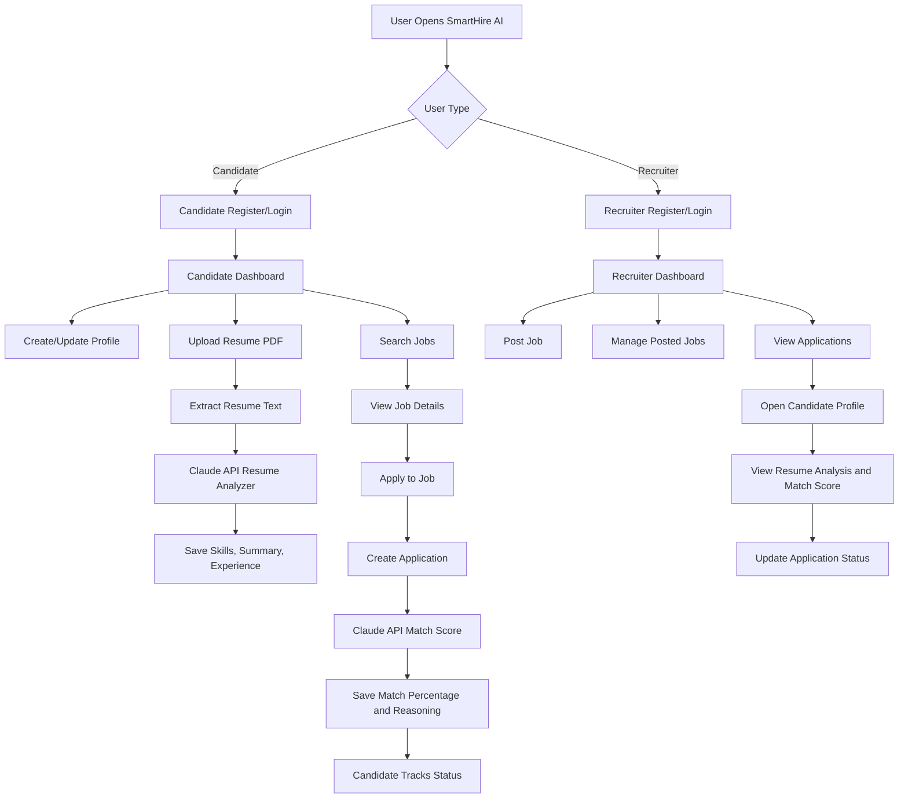
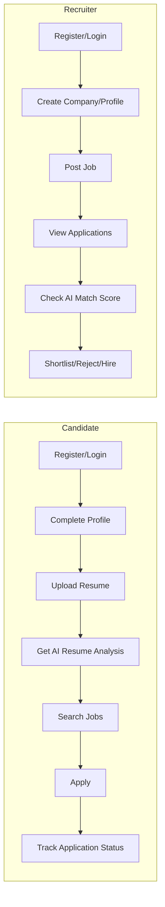
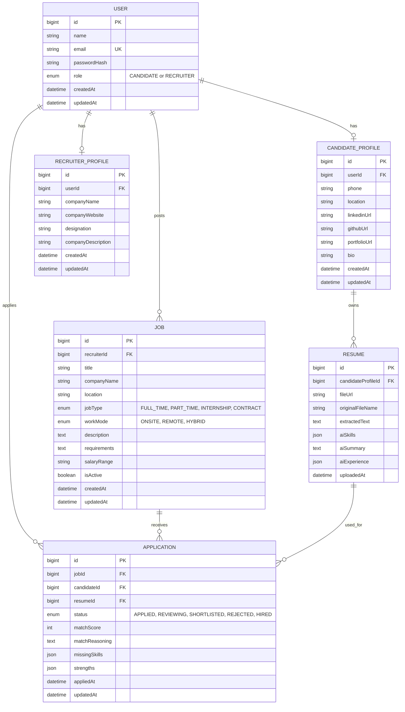
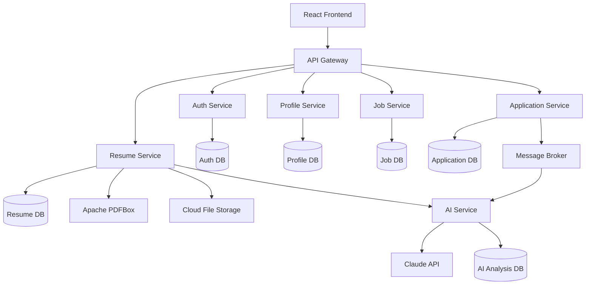
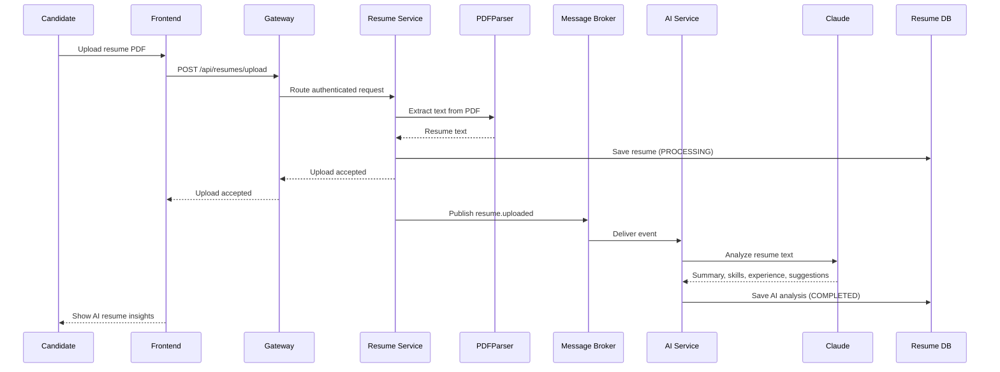
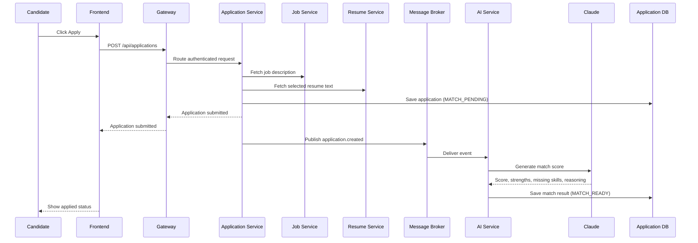
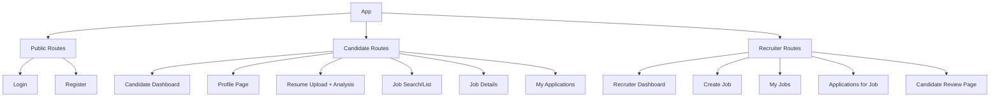

# SmartHire AI - Project Design

SmartHire AI is an AI-powered hiring platform with two user roles: Candidate and Recruiter. Candidates upload resumes and apply to jobs. Recruiters post jobs, review applications, and see AI-generated resume insights plus match scores.

## 1. High-Level System Flow



## 2. User Role Flow



## 3. Database Design ERD



## 4. Microservices Architecture



Each service is a separate Spring Boot application with its own database/schema. The API Gateway is the only public backend entry point; it routes requests, validates JWTs, and applies shared concerns such as CORS and rate limiting. Services communicate synchronously through internal REST APIs when an immediate response is required, and asynchronously through a message broker for long-running AI work.

| Service | Responsibility | Owns data |
| --- | --- | --- |
| API Gateway | Request routing, JWT validation, CORS, rate limiting | None |
| Auth Service | Registration, login, token generation, user roles | Users and credentials |
| Profile Service | Candidate and recruiter profiles | Candidate/recruiter profiles |
| Job Service | Job creation, search, updates, deactivation | Jobs |
| Resume Service | File upload, PDF text extraction, resume records | Resumes and file references |
| AI Service | Resume analysis and job-match generation using Claude | AI analyses and processing status |
| Application Service | Applications and recruiter status changes | Applications |

### Asynchronous AI Processing

Resume analysis and match scoring can take longer than a normal API request, so they should run asynchronously. Resume Service or Application Service publishes an event such as `resume.uploaded` or `application.created` to the message broker. AI Service consumes the event, calls Claude, saves the result, and publishes `resume.analyzed` or `application.match-scored`. This keeps upload/application APIs responsive and supports safe retries if the AI provider is temporarily unavailable.

## 5. AI Resume Analyzer Flow



## 6. AI Match Score Flow



## 7. Frontend Page Structure



## 8. Main API Endpoints

All public endpoints are exposed through the API Gateway. The gateway forwards each request to its owning internal service; clients never call a service directly.

### Auth

| Method | Endpoint | Purpose |
| --- | --- | --- |
| POST | `/api/auth/register` | Register candidate or recruiter |
| POST | `/api/auth/login` | Login and return JWT |
| GET | `/api/auth/me` | Get logged-in user |

### Candidate/Profile

| Method | Endpoint | Purpose |
| --- | --- | --- |
| GET | `/api/candidates/profile` | Get candidate profile |
| PUT | `/api/candidates/profile` | Update candidate profile |
| POST | `/api/resumes/upload` | Upload resume and run AI analyzer |
| GET | `/api/resumes/me` | Get candidate resume analysis |

### Recruiter/Jobs

| Method | Endpoint | Purpose |
| --- | --- | --- |
| POST | `/api/jobs` | Create job |
| GET | `/api/jobs` | List/search active jobs |
| GET | `/api/jobs/:id` | Get job details |
| PUT | `/api/jobs/:id` | Update job |
| DELETE | `/api/jobs/:id` | Deactivate job |

### Applications

| Method | Endpoint | Purpose |
| --- | --- | --- |
| POST | `/api/applications` | Apply to job and generate AI match score |
| GET | `/api/applications/me` | Candidate application tracking |
| GET | `/api/jobs/:id/applications` | Recruiter views applications for a job |
| PATCH | `/api/applications/:id/status` | Recruiter updates application status |

## 9. Recommended Tech Stack

| Layer | Technology |
| --- | --- |
| Frontend | React + Vite |
| Backend | Java + Spring Boot |
| Architecture | Spring Boot microservices + API Gateway |
| Database | PostgreSQL |
| Service Communication | Internal REST + RabbitMQ/Kafka events |
| ORM | Spring Data JPA + Hibernate |
| Auth | Spring Security + JWT + BCrypt |
| File Upload | Spring MultipartFile |
| PDF Text Extraction | Apache PDFBox |
| AI | Claude API |
| Styling | Tailwind CSS |
| Deployment | Render/Railway/Supabase |

## 10. Folder Structure

```text
SmartHire-AI/
  backend/
    api-gateway/
    auth-service/
      src/main/java/com/smarthire/auth/
    profile-service/
      src/main/java/com/smarthire/profile/
    job-service/
      src/main/java/com/smarthire/job/
    resume-service/
      src/main/java/com/smarthire/resume/
    application-service/
      src/main/java/com/smarthire/application/
    ai-service/
      src/main/java/com/smarthire/ai/
    shared-contracts/
      events/
      dto/
    docker-compose.yml

  frontend/
    src/
      api/
      components/
      context/
      pages/
      routes/
      styles/
      App.jsx
      main.jsx
    package.json

  docs/
    project-design.md
    api-design.md
```

## 11. Day 1 Implementation Target

Day 1 should focus only on the foundation:

1. Create backend and frontend folders.
2. Setup Spring Boot backend project.
3. Configure PostgreSQL and create an isolated Auth Service database/schema.
4. Create Auth Service User entity with role enum and UserRepository.
5. Add register/login APIs and Spring Security JWT handling.
6. Add API Gateway routes for Auth Service.
7. Create Docker Compose configuration for PostgreSQL, gateway, and Auth Service.
8. Test gateway-to-auth APIs with Postman/Thunder Client.

## 12. Interview Explanation Pitch

"SmartHire AI is a Java full-stack recruitment platform where candidates can upload resumes and recruiters can post jobs. The backend uses Spring Boot microservices behind an API Gateway: Auth, Profile, Job, Resume, Application, and AI services. Each service owns its database/schema, which keeps domains independently deployable and prevents direct cross-service database access. Services use internal REST calls for immediate reads and event-driven messaging for long-running AI jobs. Resume uploads are parsed with Apache PDFBox and analyzed by Claude asynchronously; application match scoring is also processed asynchronously, then the score, strengths, missing skills, and reasoning are saved for recruiters and candidates. The frontend is built with React and Vite, with role-based dashboards for candidates and recruiters."
