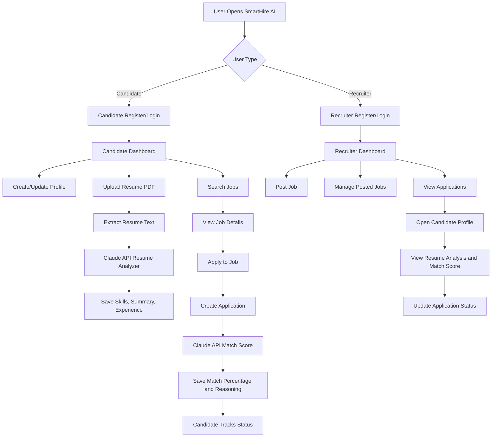
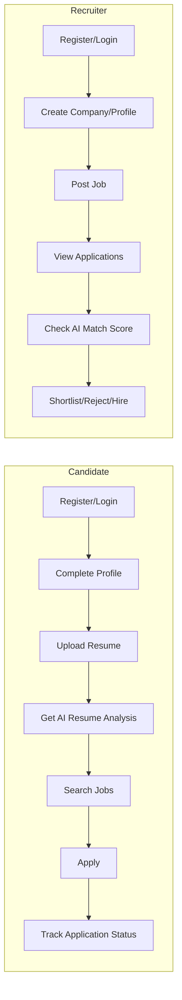
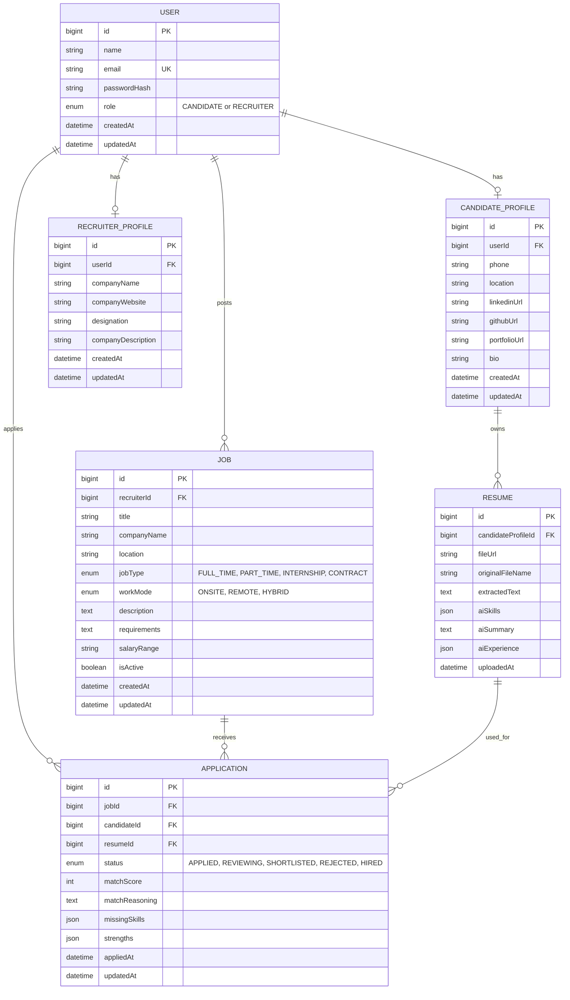
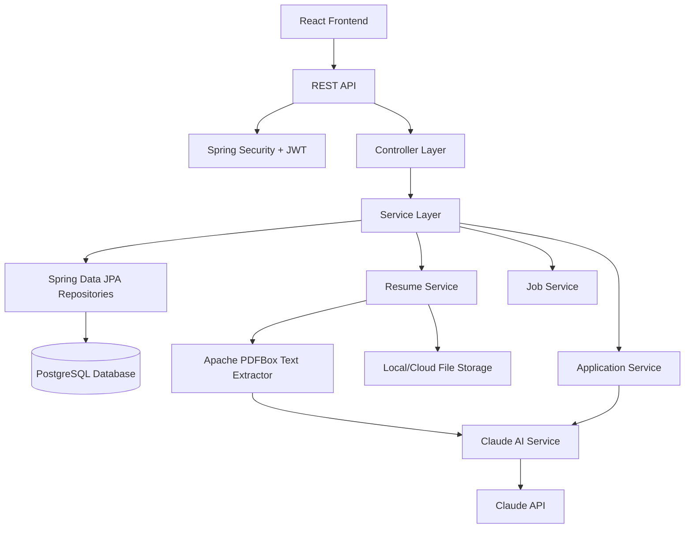
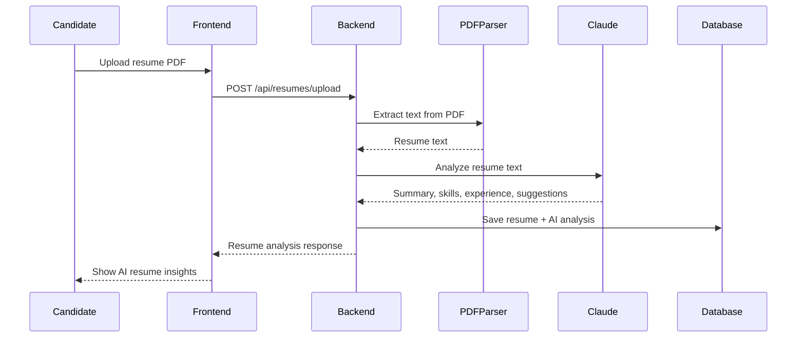
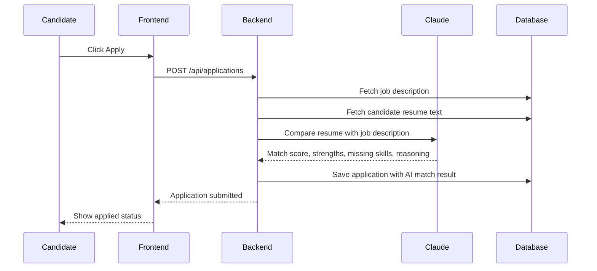
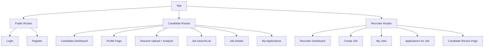

# SmartHire AI - Project Design

SmartHire AI is an AI-powered hiring platform with two user roles: Candidate and Recruiter. Candidates upload resumes and apply to jobs. Recruiters post jobs, review applications, and see AI-generated resume insights plus match scores.

## 1. High-Level System Flow



## 2. User Role Flow



## 3. Database Design ERD



## 4. Backend Architecture



## 5. AI Resume Analyzer Flow



## 6. AI Match Score Flow



## 7. Frontend Page Structure



## 8. Main API Endpoints

### Auth

| Method | Endpoint | Purpose |
| --- | --- | --- |
| POST | `/api/auth/register` | Register candidate or recruiter |
| POST | `/api/auth/login` | Login and return JWT |
| GET | `/api/auth/me` | Get logged-in user |

### Candidate/Profile

| Method | Endpoint | Purpose |
| --- | --- | --- |
| GET | `/api/candidates/profile` | Get candidate profile |
| PUT | `/api/candidates/profile` | Update candidate profile |
| POST | `/api/resumes/upload` | Upload resume and run AI analyzer |
| GET | `/api/resumes/me` | Get candidate resume analysis |

### Recruiter/Jobs

| Method | Endpoint | Purpose |
| --- | --- | --- |
| POST | `/api/jobs` | Create job |
| GET | `/api/jobs` | List/search active jobs |
| GET | `/api/jobs/:id` | Get job details |
| PUT | `/api/jobs/:id` | Update job |
| DELETE | `/api/jobs/:id` | Deactivate job |

### Applications

| Method | Endpoint | Purpose |
| --- | --- | --- |
| POST | `/api/applications` | Apply to job and generate AI match score |
| GET | `/api/applications/me` | Candidate application tracking |
| GET | `/api/jobs/:id/applications` | Recruiter views applications for a job |
| PATCH | `/api/applications/:id/status` | Recruiter updates application status |

## 9. Recommended Tech Stack

| Layer | Technology |
| --- | --- |
| Frontend | React + Vite |
| Backend | Java + Spring Boot |
| Database | PostgreSQL |
| ORM | Spring Data JPA + Hibernate |
| Auth | Spring Security + JWT + BCrypt |
| File Upload | Spring MultipartFile |
| PDF Text Extraction | Apache PDFBox |
| AI | Claude API |
| Styling | Tailwind CSS |
| Deployment | Render/Railway/Supabase |

## 10. Folder Structure

```text
SmartHire-AI/
  backend/
    src/
      main/
        java/
          com/
            smarthire/
              SmartHireApplication.java
              config/
              controller/
              dto/
              entity/
              enums/
              exception/
              repository/
              security/
              service/
        resources/
          application.properties
    uploads/
    pom.xml

  frontend/
    src/
      api/
      components/
      context/
      pages/
      routes/
      styles/
      App.jsx
      main.jsx
    package.json

  docs/
    project-design.md
    api-design.md
```

## 11. Day 1 Implementation Target

Day 1 should focus only on the foundation:

1. Create backend and frontend folders.
2. Setup Spring Boot backend project.
3. Connect PostgreSQL database.
4. Create User entity with role enum.
5. Add UserRepository with Spring Data JPA.
6. Add register/login APIs.
7. Add Spring Security JWT filter.
8. Test auth APIs with Postman/Thunder Client.

## 12. Interview Explanation Pitch

"SmartHire AI is a Java full-stack recruitment platform where candidates can upload resumes and recruiters can post jobs. I built the backend with Spring Boot, Spring Security, JWT authentication, Spring Data JPA, Hibernate, and PostgreSQL. I integrated Claude API in two places: first for resume analysis, where the uploaded PDF is converted into text using Apache PDFBox and sent to Claude for structured skill and summary extraction; second for AI match scoring, where Claude compares the resume with the job description and returns a match percentage, strengths, missing skills, and reasoning. The frontend is built with React and Vite, and the system uses role-based dashboards for candidates and recruiters."
